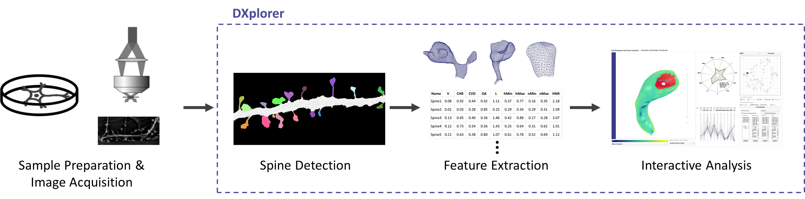
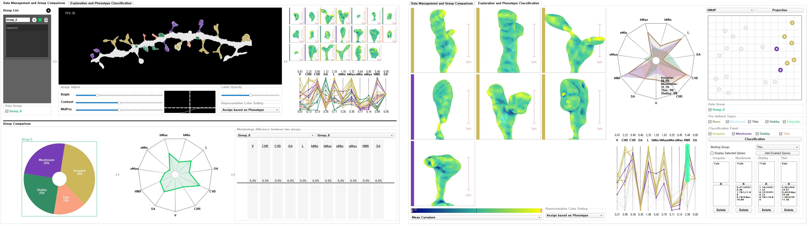
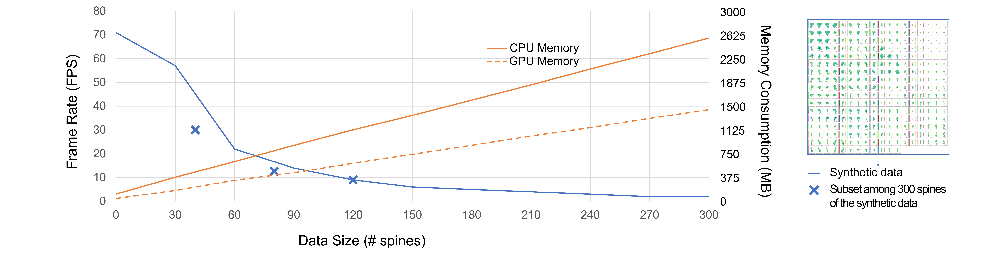

# A Unified Visualization Framework for Interactive Dendritic Spine Analysis using 3D Morphological Features

This repository includes [compiled standalone software](https://github.com/hvcl/SpineAnalysis_public/tree/main/Executable), [source code](https://github.com/hvcl/SpineAnalysis_public/tree/main/Code), and [small test dataset](https://github.com/hvcl/SpineAnalysis_public/tree/main/Executable/dataset/neuron3/).

## Contents

- [Overview](#overview)
- [System Requirements](#system-requirements)
- [Installation Guide](#installation-guide)
- [Instructions For Use](#for-testing)
- [System Scalability](#system-scalability-test)

# Overview

Dendritic spines are submicron-scale protrusions on neuronal dendrites that form postsynaptic sites of excitatory neuronal inputs. The morphological change of the dendritic spine often reflects alterations in physiological conditions and is an indicator of various neuropsychiatric conditions. However, owing to the highly dynamic and heterogeneous nature of spines, accurate measurement and objective analysis of spine morphology are major challenges in neuroscience research. Most of the conventional approaches for analyzing dendritic spines are based on 2D images, which barely reflect the actual 3D shapes. Although some recent studies have attempted to analyze spines with various 3D-based features, it is still difficult to objectively categorize and analyze spines based on 3D morphology. Here, we propose a unified visualization framework for an interactive 3D dendritic spine analysis system, DXplorer, that displays 3D rendering of spines and plots the high-dimensional features extracted from the 3D mesh of spines. With this system, users can perform the clustering of spines interactively, and explore and analyze dendritic spine based on high-dimensional features. We propose a series of high-dimensional morphological features extracted from the 3D mesh of dendritic spines. In addition, interactive machine learning classifier with visual exploration and user feedback using an interactive 3D mesh grid view ensures a more precise classification based on the spine phenotype.

# System Requirements

- Tested running environment: Windows 10, 3D structured illumination microscopy (SIM) data (0.032um x 0.032um x 0.12um) 
- Requirements for program execution: [Visual C++](https://aka.ms/vs/16/release/vc_redist.x64.exe)
- Requirements for dimension reduction methods (PCA, UMAP, tSNE) and classification (random forest): python, sklearn, numpy, umap
- Requirements for spine detection: MATLAB Runtime

# Installation Guide

- For source build: The source code is implemented with QT creator and complied with Qt 5.10.1 MSVC2017 64bit (build time is less than 5 minutes on a normal desktop computer)
- For compiled standalone software: No installation is needed for complied standalone software. Just download /Executable repository and run /Executable/SpineAnalysis.exe

# For Testing
- run /Executable/SpineAnalysis.exe => add group by pressing + button => load /Executable/dataset/neuron3/dataset.DXplorerInfo by pressing + button on the generated group
## Expected output

# System Scalability Test
- We tested the system's frame rates and memory consumptions with various size of the dataset

# Matlab Code for Spine Detection and Feature Extraction
- (/Matlab_Code/ )
These codes is extended from the research of Kashiwagi et al. 
(Kashiwagi, Yutaro, et al. "Computational geometry analysis of dendritic spines by structured illumination microscopy." Nature communications 10.1 (2019): 1-14.) 

- [DendriticSpineImageProcessing.m] 
This script is a main funcion. You can run the function with this command,

- DendriticSpineImageProcessing(inputPath,resultPath)
(e.g, DendriticSpineImageProcessing('C:/1.tif','C:/test/'))
